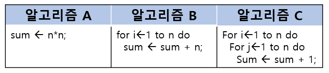

01 자료구조와 알고리즘

## 1.1 자료구조와 알고리즘

- 자료구조란?

  -> 프로그램에서도 자료들을 정리하여 보관하는 여러 가지 구조

  > " 컴퓨터 프로그램 = 자료구조 + 알고리즘 "

- 알고리즘이란 ? 

  -> 문제를 해결하는 절차 

  (알고리즘은 입력은 없어도 출력은 반드시 하나이상 있어야 한다.

  - 모호한 방법으로 기술된 명령어들의 집합은 안된다.)

  > 해야 할 일
  >
  > 1. 문제를 해결할 수 있는 방법을 고안
  > 2. 이들 방법에 따라 컴퓨터가 수행하여야 할 단계적인 절차를 자세히 서술

  - 알고리즘을 기술하는데 4가지의 방법

    ```
    1. 한글이나 영어 같은 자연어
    2. 흐름도(flowchart)
    3. 의사코드 (pseudo-code)
    4. 프로그래밍 언어
    ```

    

- 자료구조와 알고리즘 ( cal_scores.c )

  ```c
  #define MAX_ELEMENTS 100
  int scores[MAX_ELEMENTS]; // 자료구조
  
  int get_max_source(int n)
  {
      int i, largest;
      largest = scores[0];
      for(i = 0; i<n; i++){
          if(scores[i] > largest){
              largest = scores[i];
          }
      }
      return largest;
  }
  ```


## 1.2 추상 자료형

- 자료형 이란?

  -> 용어 = 데이터의 종류, 우리말 = 자료형 

  -> 데이터 뿐만 아니라 데이터 간에 가능한 연산도 고려

  > 자료형의 예시
  >
  > 정수, 문자열, 실수 ...

- 추상 자료형 (ADT : abstract data type) 이란?

  ->  추상적, 수학적으로 자료형을 정의한 것

  - 추상화란?

    -> 어떤 시스템의 간략화된 기술 또는 명세로서 시스템의 정말 핵심적인 구조나 동작에만 집중

  - ADT 란?

    -> 실제적인 구현으로부터 분리되어 정의된 자료형 / 즉, 자료형을 추상적 (수학적) 으로 정의함을 의미

    

    

    

## 1.3 알고리즘의 성능 분석

- 효율적인 알고리즘 이란?

  -> 알고리즘이 시작하여 결과가 나올 때까지의 수행시간이 짧으면서 컴퓨터 내에 있는 메모리와 같은 자원을 덜 사용하는 알고리즘

  - 효율성이 필요한 이유
    - 1.  최근 상용 프로그램의 규모가 이전에 비해서는 엄청나게 커지고 있기 때문 / 즉, 처리해야 할 자료의 양이 많기 때문이다
    - 2. 사용자들은 여전히 빠른 프로그램을 선호하다는 점

- 수행시간을 측정하는 방법

  ```c
  #include <stdio.h>
  #include <stdlib.h>
  #include <time.h>
  
  int main(void)
  {
      clock_t start, stop;
      double duration;
      start = clock();
      
      for(int i=0; i<1000000; i++) // 의미없는 반복 루프
          ;
      stop = clock();
      duration = (double)(stop-start)/CLOCKS_PER_SEC;
      printf("수행시간은 %f초입니다.\n", duration);
      return 0;
  }
  ```

  

- 시간 복잡도

  -> 알고리즘의 절대적인 수행 시간이 아니라, 알고리즘을 이루고있는 연산이 몇 번이나 수행되는지를 숫자로 표시

  - 시간 복잡도 함수

    -> 연산의 수를 입력의 개수 n의 함수로 나타낸 것, 표기는 T(n) 로 한다

    - 예시

      > 양의 정수   n을 n 번 더하는 문제를 생각
      >
      > 
      >
      > 
      >
      > 
      >
      > 
      >
      > 

- 빅오 표기법

  -> 시간 복잡도 함수에서 불필요한 정보를 제거하여 알고리즘 분석을 쉽게 할 목적으로 시간 복잡도를 표시하는 방법

  - 많이 쓰이는 빅오 표기법

    ```
    O(1) : 상수형
    O(log n) : 로그형
    O(n) : 선형
    O(nlog n) : 선형로그형
    O(n^2) : 2차형
    O(2^n) : 지수형
    O(n!) : 팩토리얼형
    ```

    

  