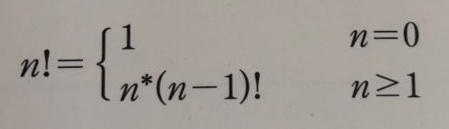
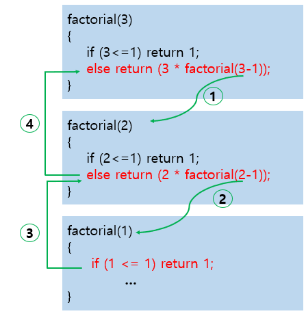
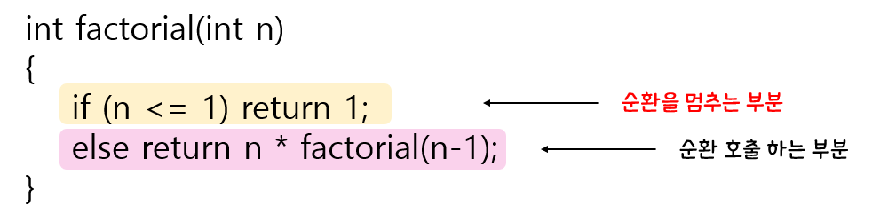
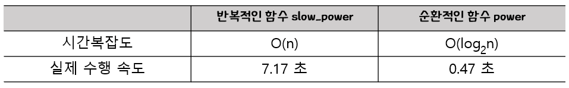
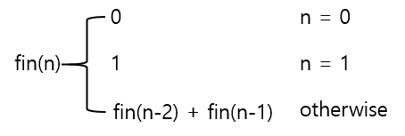
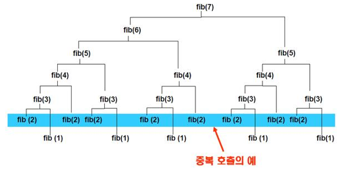
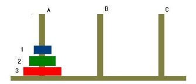
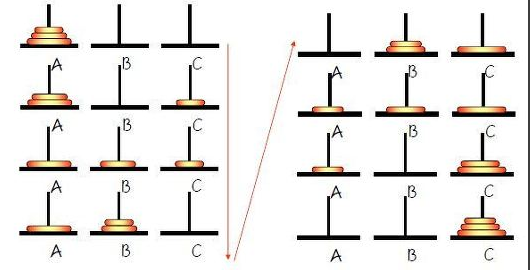

# 02 순환

## 2.1 순환의 소개


- 순환 이란?

  -> 어떤 알고리즘이나 함수가 자기 자신을 호출하여 문제를 해결하는 프로그래밍 기법

- 순환의 예

  > 정수의 팩토리얼

  

  ```c
  // 순환적인 팩토리얼 계산 프로그램
  
  int factorial(int n)
  {
      if(n<=1) return (1);
      else return (n*factorial(n-1));
  }
  ```

  

- 순환호출의 순서

  

  

  ```c
  int factorial(int n)
  {
      printf("factorial(%d)\n",n);
      if(n<=1) return (1);
      else return (n*factorial(n-1));
  }
  ```


- 순환 알고리즘의 구조

  - 구조

    

  ```c
  //  if (n <= 1 ) return(1)이 없다면
  
  int factorial(int n)
  {
      printf("factorial(%d)\n",n);
      // if(n<=1) return (1);
      // else 
      return (n*factorial(n-1));
  }
  ```

  -> 무한히 순환 호출을 하게 되고 결국 오류를 발생시킨다.


- 순환 <-> 반복

  - 반복 이란

    -> for 나 while 등의 반복구조로 되풀이 하는 방법

    -> 간명하고 효율적으로 되풀이를 구현하는 방법

  - 순환

    -> 본질적으로 순환적(recursive) 인 문제나 그러한 자료구조를 다루는 프로그램에 적합

    -> 순환 호출이 끝에서 이루어지는 순환을 **꼬리순환**이라 한다.

  ```c
  //  반복적인 팩토리얼 계산 프로그램
  
  int factorial_iter(int n)
  {
      int i, result = 1;
      for(i=1; i<=n; i++)
          result = result * i;
      return (result);
  }
  ```


## 2.2 거듭제곱값 계산

- 반복적인 거듭제곱 계산 프로그램

  ```c
  double slow_power(double x,int n)
  {
      int i;
      double result = 1.0;
      for(i=0; i<n; i++)
          result = result * x;
      return(result);
  }
  ```

  - 알고리즘

    >power (x, n):
    >
    >​	if n == 0
    >
    >​		than return 1;
    >
    >​	else if n이 짝수
    >
    >​		then return power ( x<sup>2</sup>, n/2 );
    >
    >​	else if n이 홀수
    >
    >​		then return x*power (x<sup>2</sup>, (n-1) / 2 );

- 순환적인 거듭제곱 계산 프로그램

  ```c
  double power(double x, int n)
  {
      if(n==0) return 1;
      else if ((n%2)==0)
          return power(x*x,n/2);
      else return x*power(x*x, (n-1)/2);
  }
  ```

  

- 거듭제곱계산 반복적인 프로그램과 순환적인 프로그램의 연산

  

  

## 2.3 피보나치 수열의 계산

- 피보나치 수열이란?

  

  -> 피보나치 수열에서는 앞의 두개의 숫자를 더해서 뒤의 숫자를 만든다.  /  **0, 1, 1, 2, 3, 5, 8, 13, 21, 34, 55, 89, 144**

- 순환적이 피보나치 수열 계산 프로그램

  ```c
  int fib(int n)
  {
      if(n==0) return 0;
      if(n==1) return 1;
      return (fib(n-1) + fib(n-2));
  }
  ```

  -> 위의 함수는 단순하고 이해하기 쉽지만 비효율적이다.

  

  >**T(n) = T(n-1) + T(n-2) + C**
  >
  >순환적인 수식을 풀어보면 **O(2^n)** 라는 시간 복잡도가 도출

  

- 반복적인 피보나치 수열 계산 프로그램

  ```c
  int fib_iter(int n)
  {
      if( n == 0 ) return 0;
      if( n == 1 ) return 1;
  
      int pp = 0;
      int p = 1;
      int result =0;
  
      for(int i=2; i<= n; i++)
      {
          result = p + pp;
          pp = p;
          p = result;
      }
      return result;
  }
  ```

  > 시간복잡도는 **O(n)** 가 된다.

  

- 하노이 탑

  

  >문제
  >
  >-> 막대 A에 쌓여있는 원판 3개를 막대 C로 옮기는 것
  >
  >조건
  >
  >✔ 한번에 하나의 원판만 이동할 수 있다.
  >
  >✔ 맨 위에 있는 원판만 이동할 수 있다.
  >
  >✔ 크기가 작은 원판위에 큰 원판이 쌓일 수 있다.
  >
  >✔ 중간의 막대를 임시적으로 이용할 수 있으나 앞의 조건들을 	지켜야 한다.

  

  **🔸 솔루션 **

  

  - 알고리즘

  >n개의 원판을 가지는 하노이의 탑 문제의 해답
  >
  >```c
  >// 막대 from에 쌓여있는 n개의 원판을 막대 tmp를 사용하여 막대 to로 옮긴다.
  >
  >void hanoi_tower(int n, char from, char tmp, char to)
  >{
  >    if ( n == 1){
  >        form 에 있는 한 개의 원판을 to로 옮긴다.
  >    }
  >    else{
  >        1. from의 맨앞의 원판을 제외한 나머지 원판들을 			tmp로 옮긴다.
  >        2. from에 있는 한 개의 원판을 to로 옮긴다.
  >        3. tmp의 원판들을 to로 옮긴다. 
  >    }
  >}
  >```

  >
  >
  >```c
  >// 막대 from에 쌓여있는 n개의 원판을 막대 tmp를 사용하여 막대 to로 옮긴다.
  >
  >void hanoi_tower(int n, char from, char tmp, char to)
  >{
  >    if ( n == 1){
  >        form 에 있는 한 개의 원판을 to로 옮긴다.
  >    }
  >    else{
  >        hanoi_tower(n-1, from, to, tmp);
  >        from에 있는 한 개의 원판을 to로 옮긴다.
  >        hanoi_tower(n-1, tmp, from, to);
  >    }
  >}
  >```

  ```c
  // 하노이의 탑 문제 프로그램
  
  #include <stdio.h>
  
  void hanoi_tower(int n, char from, char tmp, char to)
  {
      if(n == 1) printf("원판 1을 %c에서 %c으로 옮긴다. \n", from, to);
      else{
          hanoi_tower(n-1, from, to, tmp);
          printf("원판 %d을 %c에서 %c으로 옮긴다. \n",n, from, to);
          hanoi_tower(n-1, tmp, from, to);
      }
  }
  
  int main(void)
  {
      hanoi_tower(4, 'A', 'B', 'C');
      return 0;
  }
  ```

  

