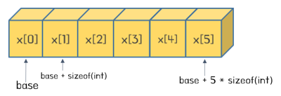
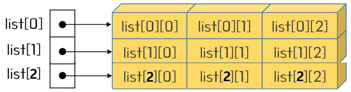
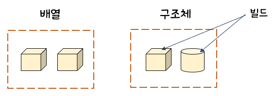
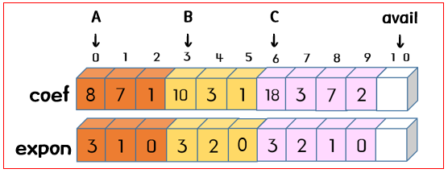
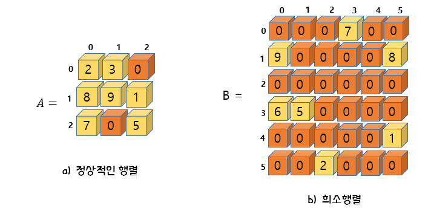
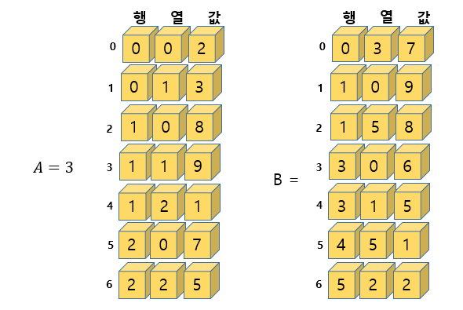
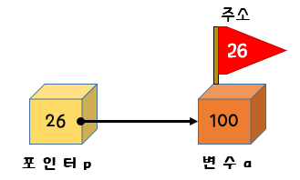
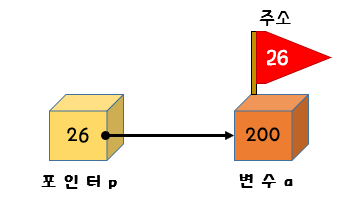
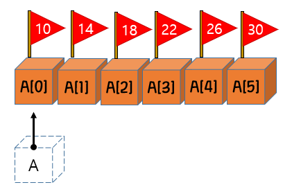
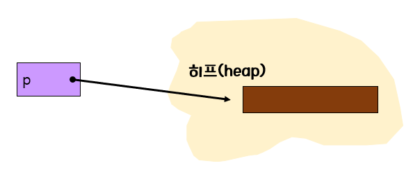

 # 03 배열, 구조체, 포인터

## 3.1 배열

- 배열의 개념

  -> 배열은 거의 모든 프로그래밍 언어에서 기본적으로 제공되는 데이터 타입

  > 예를 들어)  6개의 정수를 저장할 공간이 필요할 경우, 배열이 없다면 6개의 정수형의 변수를 선언

  ```c
  int list1, list2, list3, list4, list5
  ```

  > 배열이 지원된다면

  ```c
   int list[6];
  ```

  

- 배열 ADT

  >Array

  ```
  객체 : <인덱스, 값> 쌍의 집합
  연산 :
  	- create(size) ::= size개의 요소를 저장할 수 있는 배열 생성
  	- get(A, i) ::= 배열 A의 i번째 요소 반환 
  		+ 배열과 인덱스를 받는다
  	- set(A, i, v) ::= 배열 A의 i번째 위치에 값 v 저장
  		+ 배열, 인덱스, 값을 받아서 새로운 인덱스 위치에 값 저장
  ```


- C 언어 에서의 1차원 배열

  - 6개의 정수를 저장할 수 있는 배열 선언

    ```c
    int list[6]; // create 연산에 해당된다.
    ```

  - set과 get 연산 구현

    ```c
    list[0] = 100; // set 연산에 해당된다.
    value = list[0]; // get 연산에 해당된다.
    ```

    -> 배열의 인덱스는 0부터 시작하기에 배열의 요소는  list[0], list[1], list[2], list[3]. list[4], list[5] 가 된다.

    

    


- 2차원 배열

  -> 요소들이 2차원 형태로 나열된 배열

  ```c
  int list[3][5];
  ```

  

  


## 3.2 구조체

- 구조체의 개념

  - 배열과 구조체 차이

    -> 배열은 타입이 같은  데이터의 모임

    ​	구조체는 타입이 다른 데이터를 묶는 방법

    

  - 학생을 나타내는 구조체 (예시)

    ```c
    struct studentTag {
    	char name[10];		// 문자배열로 된 이름
    	int age;		// 나이를 나타내는 정수값
    	double gpa;		// 평균 평점을 나타내는 실수값
    };
    ```

    - studentTag

      -> 구조체와 구조체를 구별할 수 있게 해주는 식별자

      ```c
      struct studentTag s;
      ```

    - 구조체 안에 있는 멤버를 사용하려면?

      -> ' **.** ' 을 첨가한 후 항목이름을 적으면 된다.  ' **. **' 을 멤버연산자 라고 한다.

      ```c
      strucpy(s.name, "kim");
      s.age = 20;
      s.gpa = 4.3;
      ```

    - typedf

      -> 구조체를 새로운 타입으로 선언하는 것

      ```c
      typedef studentTag {
      	char name[10];		// 문자배열로 된 이름
      	int age;		// 나이를 나타내는 정수값
      	double gpa;		// 평균 평점을 나타내는 실수값
      } student;
      ```

  - 구조체를 이용한 프로그램

    ```c
    #include <stdio.h>
    
    typedef struct studentTag{
        char name[10];
        int age;
        double gpa;
    }student;
    
    int main(void)
    {
        student a ={"kim", 20, 4.3};
        student b ={"park", 21, 4.2};
        return 0;
    }
    ```

    

## 3.3 배열의 응용 : 다항식

- 다항식을 나타내는 두 가지의 자료구조

  - 첫번째, 모든 차수의 계수값을 배열에 저장

    - 예시
      $$
      10x^5 + 0*x^4 + 0*x^3 + 0*x^2 + 6x + 3
      $$
      


    

    ```c
    #define MAX_DEGREE 101	// 다항식의 최대 차수 + 1
    
    typedef struct{
        int degree;
    	float coef[MAX_DEGREE];
    }polynomial;
    
    polynomial a = {5, {10, 0, 0, 6, 3}};
    ```


​    

- 다항식 덧셈 프로그램

  ```c
  #include <stdio.h>
  #define MAX(a,b) (((a)>(b))?(a):(b))
  #define MAX_DEGREE 101
  
  typedef struct{
      int degree;
      float coef[MAX_DEGREE];
  }polynomial;
  
  polynomial poly_add1(polynomial A, polynomial B)
  {
      polynomial C;
      int Apos = 0, Bpos = 0, Cpos = 0;
      int degree_a = A.degree;
      int degree_b = B.degree;
      C.degree = MAX(A.degree, B.degree);
  
      while (Apos <= A.degree && Bpos <= B.degree){
          if(degree_a > degree_b){
              C.coef[Cpos++] = A.coef[Apos++];
              degree_a--;
          }
          else if (degree_a == degree_b){
              C.coef[Cpos++] = A.coef[Apos++] + B.coef[Bpos++];
              degree_a--; degree_b--;
          }
          else {
              C.coef[Cpos++] = B.coef[Bpos++];
              degree_b--;
          }
      }
      return C;
  }
  void print_poly(polynomial p)
  {
      for (int i = p.degree; i>0; i--)
          printf("%3.lfx^%d + ", p.coef[p.degree - i], i);
      printf("%3.lf \n", p.coef[p.degree]);
  }
  
  int main(void)
  {
      polynomial a = {5,{3,6,0,0,0,10}};
      polynomial b = {5,{3,6,0,0,0,10}};
      polynomial c;
  
      print_poly(a);
      print_poly(b);
      c= poly_add1(a,b);
      printf("-------------------------------------------------------\n");
      print_poly(c);
      return 0;
  }
  ```

  

  - 두번째, 다항식에서 0이 아닌 항만을 하나의 전역 배열에 저장

    -> 다항식의 0이 아닌 항들은 (계수, 차수)의 형식으로 구조체 배열에 저장

    ```c
    #define MAX_DEGREE 101
    typedef struct{
    	float coef;
        int expon;
    }polynomial term[MAX_TERMS];
    int avail;
    ```
    
  - 예시
      $$
      A = 8x^3 + 7x + 1,   B = 10x^3 + 3x^2 + 1
      $$
      


## 3.4 배열의 응용 : 희소행렬

- 행렬의 예

  

- 행렬의 표현

  ```
  #define MAX_ROWS 100
  #define MAX_CDLS 100
  int matrix[MAX_ROWS][MAX_COLS];
  ```

  - 행렬을 2차원 배열로 표현

  

  		> 희소행렬인 경우, 메모리의 낭비가 심하게 된다. 

  - 0이 아닌 항만 표현

    


- 전치 행렬 계산하기 #1

  ```c
  #include <stdio.h>
  #define ROWS 3
  #define COLS 3
  
  void matrix_transpose(int A[ROWS][COLS], int B[ROWS][COLS])
  {
      for (int r = 0; r<ROWS; r++)
          for (int c=0; c<COLS; c++)
              B[c][r] = A[r][c];
  }
  
  void matrix_print(int A[ROWS][COLS])
  {
      printf("======================================\n");
      for(int r=0; r<ROWS; r++){
          for (int c=0; c<COLS; c++)
              printf("%d", A[r][c]);
          printf("\n");
      }
      printf("=====================================\n");
  }
  int main(void)
  {
      int array1[ROWS][COLS] = {{2,3,0},{8,9,1},{7,0,5}};
      int array2[ROWS][COLS];
  
      matrix_transpose(array1, array2);
      matrix_print(array1);
      matrix_print(array2);
      return 0;
  }
  ```

  

- 전치행렬 계산하기 #2

  - 알고리즘

    >🔸 전치행렬
    >
    >새로운 구조체 b를 생성한다.
    >
    >구조체 a에 저장된 모든 요소에 대하여 다음을 반복
    >
    >{
    >
    >​		b.data[bindex].row = a.data[i].col;
    >
    >​		b.data[bindex].col = a.data[i].row;
    >
    >​		b.data[bindex].value = a.data[i].vaule;
    >
    >​		bindex++;
    >
    >}

    -> 새로운 전치 행렬을 만들 때, 낮은 행부터 높은 행까지 순서대로 저장되어야 한다.


## 3.5 포인터

- 포인터의 개념

  - 포인터 란?

    -> 다른 변수의 주소를 가지고 있는 변수

    
    
    ```c
    int a = 100;
    int *p;
    p = & a;
    ```
    
    > int형의 변수 a가 정의되고 p는 int형을 가리키는 포인터로 정의된다. p가 a를 가리키게 하려면 a의 주소를 p에 대입한다. 변수의 주소는 & 연산자를 적용시켜서 추출할 수 있다.
    
    

- 포인터와 관련된 연산자

  - ' & ' 연산자 = 주소연산자

    -> 변수의 주소를 추출하는 연산자이다. 포인터 p가 특정한 변수를 가리키게 하려면 변수의 주소를 &연산자로 추출하여서 p에 대입한다.

    ```c
    int a; // 정수형 변수
    p = &a ; // 변수의 주소를 포인터에 저장
    ```

  - ' * ' 연산자 = 간접참조 연산자 (역참조 연산자)

    -> 포인터가 가리키는 장소에 값을 저장하는 연산자이다. 예를 들어 p가 가리키는 장소에 200을 저장하려면 다음과 같은 문장이 된다.

    ```c
    *p = 200;
    ```

    

- 다양한 포인터

  ```c
  int *p; // p는 int형 변수를 가리키는 포인터
  float *pf // pf는 double형 변수를 가리키는 포인터
  char *pc; // pc는 char형 변수를 가리키는 포인터
  ```

  

- 널포인터

  -> 어떤 객체도 가리키는 않는 포인터

  -> C언어에서 널 포인터는 NULL 이라는 매크로로 표시한다.

  ```c
  if(p == NULL){
  	fprintf(stderr, "오류: 포인터가 아무것도 가리키지 않습니다.");
  	return;
  }
  ```

  -> 포인터가 아무것도 가리키고 있지 않을 때는 항상 널 포인터상태로 만들어 두는 것이 좋다.


- 함수 매개변수로 포인터 사용하기

  ```c
  // swap 포인터를 함수의 매개변수로 사용하는 프로그램
  
  #include <Stdio.h>
  
  void swap(int *px, int *py)
  {
      int tmp;
      tmp = *px;
      *px = *py;
      *py = tmp;
  }
  int main(void)
  {
      int a=1, b=2;
      printf("swap을 호출하기 전 : a=%d, b=%d\n", a,b);
      swap(&a, &b);
      printf("swap을 호출한 다음: a=%d, b=%d\n", a, b);
      return 0;
  }
  ```

  

- 배열과 포인터

  

  	> 배열의 이름이 점선으로 그려져 있는 이유는 실제로 컴파일러가 배열의 이름에 공간을 할당하지 않기 때문이다. 

  ```c
  // 배열을 함수의 매개변수로 사용하는 프로그램
  
  #include <stdio.h>
  #include <stdlib.h>
  #include <string.h>
  #define SIZE 6
  
  void get_integers(int list[])
  {
      printf("6개의 정수를 입력하시오: ");
      for(int i =0; i<SIZE; i++)
      {
          scanf("%d", &list[i]);
      }
      // printf("%d",list[i]); // list 출력하기
  }
  int cal_sum(int list[])
  {
      int sum = 0;
      for(int i=0; i<SIZE; i++)
      {
          sum += *(list+1);
      }
      return sum;
  }
  int main(void)
  {
      int list[SIZE];
      get_integers(list);
      printf("합 = %d", cal_sum(list));
      printf("", *list); // list 출력하기
      return 0;
  }
  ```

  

- 동적 메모리 할당

  -> c언어에서는 필요한 만큼의 메모리를 운영체제로 부터 할당받아서 사용하고, 사용이 끝나면 시스템에 메모리를 반납하는 기능

  

  >동적 메모리가 할당되는 공간 = 히프(heap)

  ```c
  int *p;
  p = (int *) malloc(sizeof(int)); // 1. 동적 메모리 할당
  *p = 1000; // 2. 동적 메모리 사용
  free(p); // 3. 동적 메모리 반납
  ```

  ```c
  // 동적메모리 할당의 예
  
  #include <stdio.h>
  #include <stdlib.h>
  #include <string.h>
  #include <malloc.h>
  
  #define SIZE 10
  
  int main(void)
  {
      int *p;
  
      p=(int *)malloc(SIZE * sizeof(int));
      if(p==NULL){
          fprintf(stderr, "메모리가 부족해서 할당할 수 없습니다.\n");
          exit(1);
      }
      for(int i =0; i<SIZE; i++)
          p[i] = i;
      for(int i=0; i<SIZE; i++)
          printf("%d", p[i]);
      free(p);
      return 0;
  }
  ```

  

- 구조체와 포인터

  ->구조체에 대한 포인터를 선언하고 포인터를 통하여 구조체 멤버에 접근할 수 있다. 

  -> 포인터를 통하여 구조체의 멤버에 접근하는 편리한 표기법 "->" 이다.

  -> ps 가 구조체를 가리키는 포인터일 때 (*ps).i보다 ps->i라고 쓰는 것이 편리하다

  ```c
  #include <stdio.h>
  #include <stdlib.h>
  #include <string.h>
  
  typedef struct studentTag {
      char name[10];
      int age;
      double gpa;
  }student;
  
  int main(void)
  {
      student *s;
  
      s=(student *)malloc(sizeof(student));
      if(s==NULL){
          fprintf(stderr, "메모리가 부족해서 할당할 수 없습니다.\n");
          exit(1);
      }
      strcpy(s->name, "Park");
      s->age = 20;
  
      free(s);
      return 0;
  }
  ```

  > s 는 구조체를 가리키는 포인터로 선언되었다. 
  >
  > (*s).name이라고 할 수도 있지만 s -> name이 더 편리하다.

  

  