# 04 스택

## 4.1 스택

- 스택이란?

  -> 영어사전 = (건초, 밀집 따위를 쌓아놓는) 더미, 낟가리 를 의미한다.

  -> 식당에 쌓여있는 접시 더미, 책상에 쌓여있는 책, 창고에 쌓여있는 상자 등이 전형적인 스택의 예

  -> 복귀할 주소를 기억하는데 사용된다.

  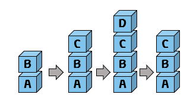

  >입출력 형태를 후입선출 ( LIFO : Last-In First-Out )

  - 스택의 구조

    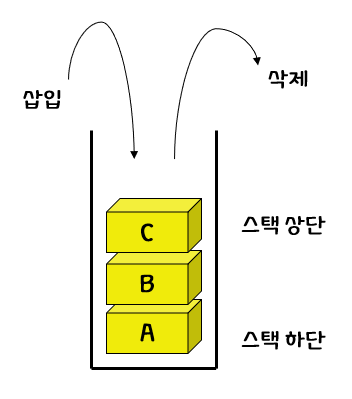

  >스택에서 입출력이 이루어지는 부분을 스택 상단(stack top) 이라 하고 반대쪽인 바닥부분을 스택 하단(stack bottom) 이라고 한다. 

  

- 추상 자료형 스택

  

  > 삽입 연산으로 push 연산, 삭제 연산으로 pop 연산

  

## 4.2 스택의 구현

- 추상 자료형 스택

  - 1차원 배열

    -> int형의 1차원 배열 stack[MAX_STACK_SIZE] 이 필요하다.  이 배열을 이용하여 스택의 요소들을 저장하게 된다. 

    ​	스택에서 가장 최근에 입력되었던 자료를 가리키는 top 변수가 필요하다. 가장 먼저 들어온 요소는 stack[0]에 가장 최근에 들어온 요소는 stack[top]에 저장된다.
    

    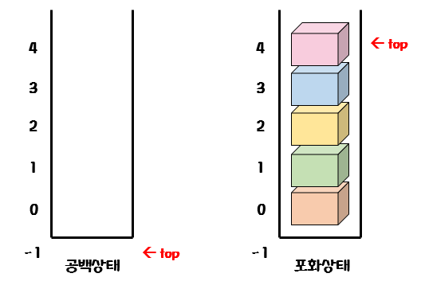

    > top 변수는 스택이 비어 있으면 -1의 값을 갖는다. 

    - 알고리즘

      > ✔ 스택의 is_empty 연산
      >
      > ```c
      > is_empty(S):
      > 	if top == -1  // 스택이 비어있는지를 검사하기 위해 top을 -1과 비교한다
      > 		then return TRUE // top이 -1일시 TRUE 반환
      > 		else return FALSE
      > ```
      >
      > - 프로그램
      >
      > 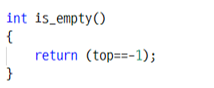

    - 알고리즘 

      >✔ 스택의 is_full 연산
      >
      >```c
      >is_full(S):
      >	if top >= (MAX_STACK_SIZE -1) // 같으면 포화상태로 판정
      >		then return TRUE 
      >		else return FALSE
      >```
      >
      >- 프로그램
      >
      >

    - 알고리즘

      >✔ 스택의 push 연산
      >
      >```c
      >push(S, x):
      >	if is_full(S)
      >        then error "overflow"
      >        else top <- top+1
      >            stack[top]<-x
      >```
      >
      >- 프로그램
      >
      >  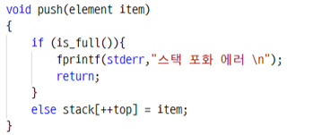

    - 알고리즘

      >✔ 스택의 pop 연산
      >
      >```c
      >push(S, x):
      >
      >if is_empty(S)
      >    then error "underflow"
      >    else e <- stack[top]
      >    	top <- top -1
      >        return e
      >```

- 전역변수로 구현하는 방법

  ```c
  #include <stdio.h>
  #include <stdlib.h>
  
  #define MAX_STACK_SIZE 100
  typedef int element;
  element stack[MAX_STACK_SIZE];
  int top = -1;
  
  int is_empty()
  {
      return (top==-1);
  }
  
  int is_full()
  {
      return (top == (MAX_STACK_SIZE -1));
  }
  void push(element item)
  {
      if (is_full()){
          fprintf(stderr,"스택 포화 에러 \n");
          return;
      }
      else stack[++top] = item;
  }
  element pop()
  {
      if (is_empty()){
          fprintf(stderr,"스택 공백 에러\n");
          exit(1);
      }
      else return stack[top--];
  }
  element peek()
  {
      if(is_empty()){
          fprintf(stderr, "스택 공백 에러 \n");
          exit(1);
      }
      else return stack[top];
  }
  int main(void)
  {
  
      push(1);
      push(2);
      push(3);
      printf("%d\n", pop());
      printf("%d\n", pop());
      printf("%d\n", pop());
      printf("%d\n", pop());
      printf("%d\n", peek());
      return 0;
  }
  ```

  

- 스택의 요소를 구조체로 하기

  ```c
  #include <stdio.h>
  #include <stdlib.h>
  
  #define MAX_STACK_SIZE 100
  #define MAX_STRING 100
  
  typedef struct {
      int student_no;
      char name[MAX_STRING];
      char address[MAX_STRING];
  }element;
  
  element stack[MAX_STACK_SIZE];
  int top = -1;
  
  int is_empty()
  {
      return (top==-1);
  }
  int is_full()
  {
      return (top == (MAX_STACK_SIZE -1));
  }
  void push(element item)
  {
      if (is_full()){
          fprintf(stderr,"스택 포화 에러 \n");
          return;
      }
      else stack[++top] = item;
  }
  element pop()
  {
      if (is_empty()){
          fprintf(stderr,"스택 공백 에러\n");
          exit(1);
      }
      else return stack[top--];
  }
  element peek()
  {
      if(is_empty()){
          fprintf(stderr, "스택 공백 에러 \n");
          exit(1);
      }
      else return stack[top];
  }
  int main(void)
  {
      element ie ={2019000, "Hong", "Soeul"};
      element oe;
  
      push(ie);
      oe = pop();
  
      printf("학번: %d\n", oe.student_no);
      printf("이름 : %d\n", oe.name);
      printf("주소 : %s\n", oe.address);
      return 0;
  }
  ```


- 관련된 데이터를 함수의 매개변수로 전달하는 방법

  ```c
  #include <stdio.h>
  #include <stdlib.h>
  
  #define MAX_STACK_SIZE 100
  
  typedef int element;
  typedef struct {
      element data[MAX_STACK_SIZE];
      int top;
  } StackType;
  
  
  void init_stack(StackType *s)
  {
      s->top = -1;
  }
  
  int is_empty(StackType *s)
  {
      return (s->top == -1);
  }
  int is_full(StackType *s)
  {
      return ( s->top == (MAX_STACK_SIZE -1));
  }
  void push(StackType *s, element item)
  {
      if (is_full(s)){
          fprintf(stderr,"스택 포화 에러 \n");
          return;
      }
      else s->data[++(s->top)] = item;
  }
  element pop(StackType *s)
  {
      if (is_empty(s)){
          fprintf(stderr,"스택 공백 에러\n");
          exit(1);
      }
      else return s->data[(s->top)--];
  }
  element peek(StackType *s)
  {
      if(is_empty(s)){
          fprintf(stderr, "스택 공백 에러 \n");
          exit(1);
      }
      else return s->data[s->top];
  }
  int main(void)
  {
      StackType s;
  
      init_stack(&s);
      push(&s, 1);
      push(&s, 2);
      push(&s, 3);
      printf("%d\n",pop(&s));
      printf("%d\n",pop(&s));
      printf("%d\n",pop(&s));
      return 0;
  }
  ```

  

- 스택을 동적 메모리 할당으로 생성하는 방법

  ```c
  // 동적 스택
  
  ...
  
  int main(void)
  {
      StackType *s;
      s= (StackType *)malloc(sizeof(StackType)); //스택을 동적으로 생성한다.
      init_stack(s);
      push(s,1);
      push(s,2);
      push(s,3);
      printf("%d\n",pop(s));
      printf("%d\n",pop(s));
      printf("%d\n",pop(s));
      free(s); // 동적 메모리는 반드시 반환해야 한다.
  }
  ```


## 4.3 동적 배열 스택

- malloc () 함수

  -> 호출시 실행 시간에 메모리를 할당 받을 수 있다.

  -> 필요할 때마다 스택의 크기를 동적으로 늘릴 수 있다. 

  ```c
  typedef int element;
  typedef struct {
      element *data;
      int capacity;
      int top;
  } StackType;
  ```

  ```c
  // 스택 생성 함수
  void init_stack(StackType *s)
  {
      s->top = -1;
      s->capacity = 1;
      s->data = (element *)malloc(s->capacity * sizeof(element));
  }
  
  // 스택 삭제 함수
  void delete(StackType *s)
  {
  	free(s);
  }
  ```

  > 스택이 만들어질 때, 1개의 요소를 저장할 수 있는 공간을 일단 확보한다.

  ```c
  void push(StackType *s, element item)
  {
      if (is_full(s)){
          s->capacity *= 2;
          s->data =
              (element *)realloc(s->data, s->capacity * sizeof(element));
      }
      s->data[++(s->top)] = item;
  }
  ```

  > 가장 큰 변화가 있는 함수는 push() 이다. 공간이 부족하면 메모리를 2배로 더 확보한다.

- 동적 배열 스택 프로그램

  ```c
  #include <stdio.h>
  #include <stdlib.h>
  
  typedef int element;
  typedef struct {
      element *data;
      int capacity;
      int top;
  } StackType;
  
  void init_stack(StackType *s)
  {
      s->top = -1;
      s->capacity = 1;
      s->data = (element *)malloc(s->capacity * sizeof(element));
  }
  
  int is_empty(StackType *s)
  {
      return (s->top == -1);
  }                                                                                                                                                                
  int is_full(StackType *s)
  {
      return ( s->top == (s->capacity -1));
  }
  void push(StackType *s, element item)
  {
      if (is_full(s)){
          s->capacity *= 2;
          s->data =
              (element *)realloc(s->data, s->capacity * sizeof(element));
      }
      s->data[++(s->top)] = item;
  }
  element pop(StackType *s)
  {
      if (is_empty(s)){
          fprintf(stderr,"스택 공백 에러\n");
          exit(1);
      }
      else return s->data[(s->top)--];
  }
  
  int main(void)
  {
      StackType s; 
  
      init_stack(&s);
      push(&s, 1);
      push(&s, 2);
      push(&s, 3);
      printf("%d\n",pop(&s));
      printf("%d\n",pop(&s));
      printf("%d\n",pop(&s));
      free(s.data);
      return 0;
  }
  ```

## 4.4 스택의 응용1

- 스택의 응용 : 괄호 검사 문제

  - 검사조건

    ```
    조건 1 : 왼쪽 괄호의 개수와 오른쪽 괄호의 개수가 같아야 한다.
    조건 2 : 같은 종류의 괄호에서 왼쪽 괄호는 오른쪽 괄호보다 먼저 나와야 한다.
    조건 3 : 서로 다른 종류의 왼쪽 괄호와 오른쪽 괄호 쌍은 서로를 교차하면 안된다.
    ```

    ---

    ``` 
    { A[(i+1)]=0; } -> 오류 없음
    if ((i==0)) && (j==0) -> 오류 : 조건 1 위반
    A [(i+1])=0 -> 오류 : 조건 3 위반
    ```

    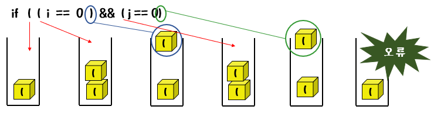

    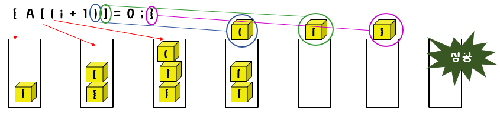

    

    - 알고리즘

      > ✔ 괄호검사
      >
      > 
      >
      > check_matching(expr) :
      >
      > 
      >
      > while (입력 expr의 끝이 아니면)
      >
      > ch <- expr의 다음 글자
      >
      > switch (ch)
      >
      > ​	case '(' : case '[' : case '{' : ch를 스택에 삽입
      >
      > ​		break
      >
      > ​	case ')' : case '}' : 
      >
      > ​			if ( 스택이 비어 있으면 )
      >
      > ​				then 오류
      >
      > ​				else 스택에서 open_ch를 꺼낸다
      >
      > ​					if (ch 와 open_ch가 같은 짝이 아니면)
      >
      > ​						then 오류 보고
      >
      > ​	break
      >
      > if ( 스택이 비어 있지 않으면 )
      >
      > ​	then 오류

      

      ```c
      // 괄호검사 프로그램
      
      #include <stdio.h>
      #include <stdlib.h>
      #include <string.h>
      #define MAX_STACK_SIZE 100
      
      typedef char element;
      typedef struct {
          element data[MAX_STACK_SIZE];
          int top;
      } StackType;
      
      void init_stack(StackType *s)
      {
          s->top = -1;
      }
      
      int is_empty(StackType *s)
      {
          return (s->top == -1);
      }
      int is_full(StackType *s)
      {
          return ( s->top == (MAX_STACK_SIZE -1));
      }
      void push(StackType *s, element item)
      {
          if (is_full(s)){
              fprintf(stderr,"스택 포화 에러 \n");
              return;
          }
          else s->data[++(s->top)] = item;
      }
      element pop(StackType *s)
      {
          if (is_empty(s)){
              fprintf(stderr,"스택 공백 에러\n");
              exit(1);
          }
          else return s->data[(s->top)--];
      }
      element peek(StackType *s)
      {
          if(is_empty(s)){
              fprintf(stderr, "스택 공백 에러 \n");
              exit(1);
          }
          else return s->data[s->top];
      }
      
      int check_matching(const char *in)
      {
          StackType s;
          char ch, open_ch;
          int i,n = strlen(in);
          init_stack(&s);
      
          for(i=0; i<n; i++)
          {
              ch = in[i];
              switch(ch) {
              case '(': case '[' : case '{' :
                  push(&s, ch);
                  break;
              case ')' : case ']' : case '}' :
                  if (is_empty(&s)) return 0;
                  else {
                      open_ch = pop(&s);
                      if((open_ch == '(' && ch != ')') ||
                          (open_ch == '[' && ch != ']') ||
                          (open_ch == '{' && ch != '}')){
                          return 0;
                          }
                      break;
                  }
              }
          }
          if(!is_empty(&s)) return 0;
          return 1;
      }
      
      int main(void)
      {
          char *p = "{A[(i+1)] = 0; }";
          if (check_matching(p) == 1)
              printf("%s 괄호검사 성공\n", p);
          else
              printf("%s 괄호검사실패\n", p);
          return 0;
      
      }
      ```

## 4.5 스택의 응용 2

- 스택의 응용 : 후위 표기 수식의 계산

  - 수식을 표기하는 방법

    - 전위

      -> 연산자가 피연산자 앞에 있으면 전위

    - 중위

      -> 연산자가 피연산자 사이에 있으면 중위

    - 후위

      -> 연산자가 피연산자 뒤에 있으면 후위

    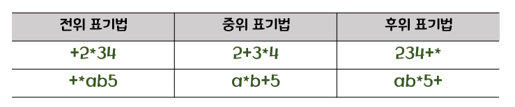

- 후위 표기 수식 스택의 내용

  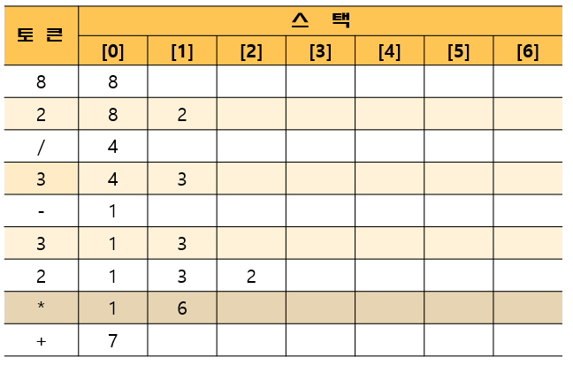

  

  - 후위 표기 수식의 계산 과정

    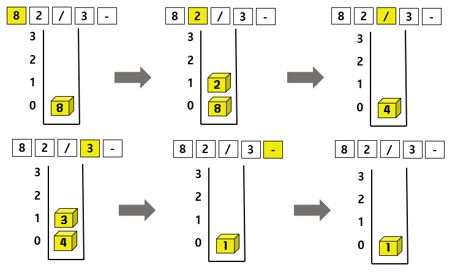

    - 알고리즘

      >✔ 후위 표기 수식 계산 알고리즘
      >
      >
      >
      >calc_posfix : 
      >
      >​	스택  s를 생성하고 초기화한다.
      >
      >​	for item in 후위표기식 do
      >
      >​		if ( item 이 피연산자이면 )
      >
      >​			push(s, item)
      >
      >​		else if ( item이 연산자 op이면 )
      >
      >​			second <- pop(s)
      >
      >​			first <- pop(s)
      >
      >​			result <- first op second  // op 는 +-*/ 중의 하나
      >
      >​	final_result <- pop(s) ;

      

    ```c
    #include <stdio.h>
    #include <stdlib.h>
    #include <string.h>
    #define MAX_STACK_SIZE 100
    
    typedef char element;
    typedef struct {
        element data[MAX_STACK_SIZE];
        int top;
    } StackType;
    
    void init_stack(StackType *s)
    {
        s->top = -1;
    }
    
    int is_empty(StackType *s)
    {
        return (s->top == -1);
    }
    int is_full(StackType *s)
    {
        return ( s->top == (MAX_STACK_SIZE -1));
    }
    void push(StackType *s, element item)
    {
        if (is_full(s)){
            fprintf(stderr,"스택 포화 에러 \n");
            return;
        }
        else s->data[++(s->top)] = item;
    }
    element pop(StackType *s)
    {
        if (is_empty(s)){
            fprintf(stderr,"스택 공백 에러\n");
            exit(1);
        }
        else return s->data[(s->top)--];
    }
    element peek(StackType *s)
    {
        if(is_empty(s)){
            fprintf(stderr, "스택 공백 에러 \n");
            exit(1);
        }
        else return s->data[s->top];
    }
    
    int eval(char exp[])
    {
        int op1, op2, value, i = 0;
        int len =strlen(exp);
        char ch;
        StackType s;
        
        init_stack(&s);
        for(i-0; i<len; i++){
            ch = exp[i];
            if(ch != '+' && ch != '-' && ch != '*' && ch != '/'){
                value = ch - '0';
                push(&s, value);
             }
        else {
            op2=pop(&s);
            op1=pop(&s);
            switch(ch){
            case '+':push(&s, op1 + op2); break;
            case '-':push(&s, op1 - op2); break;
            case '*':push(&s, op1 * op2); break;
            case '/':push(&s, op1 / op2); break;
                }
            }
        }
        return pop(&s);
    }
    int main(void)
    {
        int result;
        printf("후위표기식은 82/3-32*+\n");
        result = eval("82/3-32*+");
        printf("결과값은 %d\n", result);
        return 0;
    }
    ```

    

- 중위표기수식을 후위표기수식으로 변환

  - 그림예시

    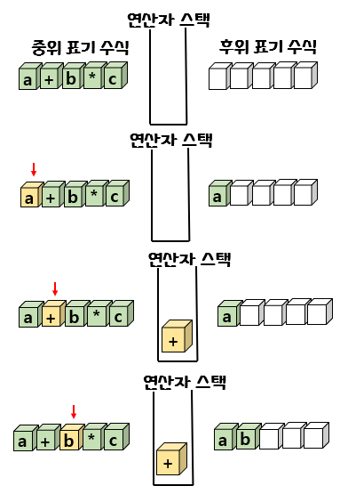

    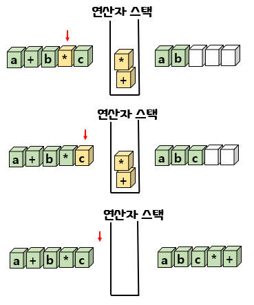

    - 알고리즘

      >✔ 중위 표기 수식을 후위 표기 수식으로 변환
      >
      >
      >
      >infix_to_postfix(exp):
      >
      >스택 s를 생성하고 초기화
      >
      >while (exp 에 처리할 문자가 남아 있으면)
      >
      >​	ch <- 다음에 처리할 문자
      >
      >​	switch (ch)
      >
      >​	case 연산자 :
      >
      >​			while ( peek(s) 의 우선순위 >= ch의 우선순위) do
      >
      >​					e<- pop(s)
      >
      >​					e를 출력
      >
      >​			push (s, ch);
      >
      >​			break;
      >
      >​	case 왼쪽 괄호 :
      >
      >​			push (s,ch) ;
      >
      >​			break;
      >
      >​	case 오른쪽 괄호 :
      >
      >​			e <- pop(s) ;
      >
      >​			while ( e이 아니다 왼쪽 괄호) do\
      >
      >​					e를 출력
      >
      >​					e<- pop(s)
      >
      >​			break;
      >
      >​	case 피연산자 :
      >
      >​					ch를 출력
      >
      >​			break;
      >
      >while ( not is_empty(s) ) do
      >
      >​			e <- pop(s) 
      >
      >​			e를 출력

 