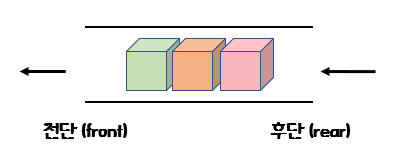
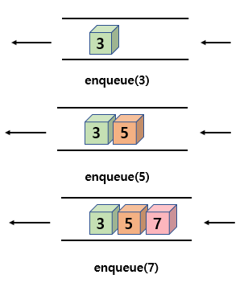
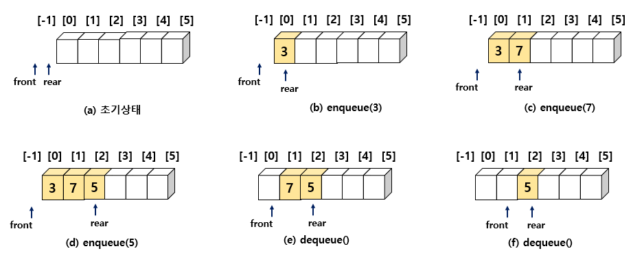
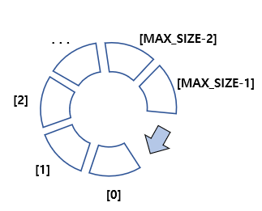
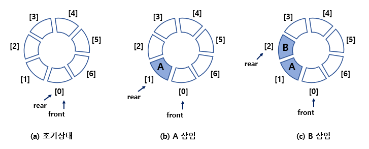
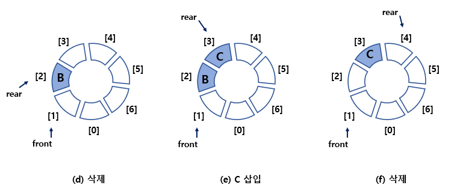
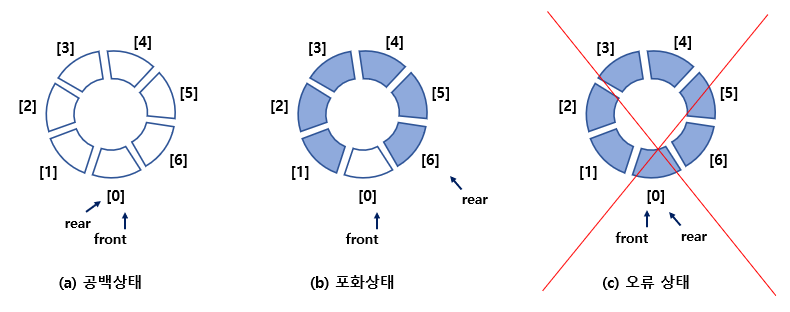
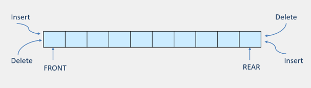
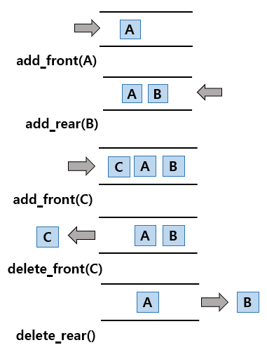

# 05 큐

## 5.1 큐 추상 데이터 타입

- 큐 란?

  -> 나중에 들어온 데이터가 먼저 나가는 구조

  -> 뒤에서 새로운 데이터가 추가되고 앞에서 데이터가 하나씩 삭제되는 구조

  -> 삽입과 삭제가 다른 쪽에서 일어난다.

  

  >입출력 형태를 선입선출 ( FIFO : First-In First-Out )
  >
  >삽입이 일어나는 곳을 **후단(rear)**라고 하고 삭제가 일어나는 곳을 **전단(front)**라 한다.

  - 삽입 (enqueue)

    -> 큐에 요소를 추가하는 연산으로서 큐의 맨 뒤에 새로운 요소를 추가한다.

    

  - 삭제 (dequeue)

    -> 큐의 맨 앞에 있는 요소를 꺼내서 외부로 반환한다. 

    -> 양 끝에서 일어나기에 양단을 잘 살펴보아야 한다.

    


## 5.2 선형 큐

- 1차원 배열

  -> 배열을 정의하고 삽입

  -> 삭제를 위한 변수인 front와 rear 를 만든다. 

  

  > front는 큐의 첫번째 요소, rear는 큐의 마지막 요소를 가리킨다. 
  >
  > front와 rear의 초기값은 -1이다.
  >
  > 데이터가 증가되면 rear를 하나 증가하고 그 위치에 데이터가 저장된다.
  >
  > 삭제할 때도 front를 하나 증가하고 front가 가리키는 위치에 있는 데이터를 삭제한다.

- 선형큐의 구현

  ```c
  #include <stdio.h>
  #include <stdlib.h>
  #include <string.h>
  #define MAX_QUEUE_SIZE 5
  
  typedef int element;
  typedef struct {
      int front ;
      int rear;
      element data[MAX_QUEUE_SIZE];
  } QueueType;
  
  void error(char *message)
  {
      fprintf(stderr, "%s\n", message);
      exit(1);
  }
  void init_queue(QueueType *q)
  {
      q->rear = -1;
      q->front = -1;
  }
  void queue_print(QueueType *q)
  {
      for(int i =0; i<MAX_QUEUE_SIZE; i++){
          if(i<= q->front || i>q->rear)
              printf("   | ");
          else
              printf("%d | ", q->data[i]);
      }
      printf("\n");
  }
  int is_full(QueueType *q)
  {
      if (q->rear == MAX_QUEUE_SIZE -1)
          return 1;
      else 
          return 0;
  }
  int is_empty(QueueType *q)
  {
      if (q->front == q->rear)
          return 1;
      else 
          return 0;
  }
  void enqueue(QueueType *q, int item)
  {
      if(is_full(q))
      {
          error("큐가 포화상태입니다.");
          return;
      }
      q->data[++(q->rear)] = item;
  }
  int dequeue(QueueType *q)
  {
      if(is_empty(q)){
          error("큐가 공백상태입니다");
          return -1;
      }
      int item = q->data[++(q->front)];
      return item;
  }
  int main(void)
  {
      int item = 0;
      QueueType q;
  
      init_queue(&q);
  
      enqueue(&q, 10); queue_print(&q);
      enqueue(&q, 20); queue_print(&q);
      enqueue(&q, 30); queue_print(&q);
  
      item = dequeue(&q); queue_print(&q);
      item = dequeue(&q); queue_print(&q);
      item = dequeue(&q); queue_print(&q);
      return 0;
  }
  ```

  

## 5.3 원형 큐

- 선형 큐의 문제점

  -> front와 rear의 값이 계속 증가만 하기 때문에 언젠가는 배열의 끝에 도달하게 되고, 

  ​	배열의 앞부분이 비어있더라도 사용하지 못한다.

- 원형 큐 란?

  -> 배열이 원형으로 변환

  -> front와 rear의 값이 배열의 끝인 (MAX_QUEUE_SIZE-1) 에 도달하면 다음에 증가되는 값은 0이 되도록 한다.

  -> 배열이 원형으로 처음과 끝이 연결되어 있다고 생각한다.

  

  > 초기값은 -1 이 아닌 0 이다.

  

  - 삽입

    

    > front,rear 는 모두 0이다. 
    >
    > 삽입 시에는 rear가 먼저 증가되고 증가된 위치에 새로운 데이터가 삽입된다.

    - 알고리즘

      >enqueue(Q, x):
      >
      >​	rear -> (rear + 1) % MAX_QUEUE_SIZE;
      >
      >​	Q[rear]<- x;

  - 삭제

    

    > front 가 먼저 증가된 다음, 증가된 위치에서 데이터를 삭제한다. 

    - 알고리즘

      > dequeue(Q):
      >
      > ​	front <- (front+1) % MAX_QUEUE_SIZE;
      >
      > ​	return Q[front] ;

    

- 원형 큐의 공백 상태와 오류 상태

  

  > a) front와 rear 의 값이 같으면 원형 큐가 비어 있음을 나타낸다.
  >
  > b) front == rear이면 공백 상태
  >
  > c) 공백상태와 구분할 수 없기 때문에 한자리를 비워두어야만 한다.
  >
  > ✔ 요소들의 개수를 저장하고 있는 추가적인 변수 count 변수를 사용할 수 있다면 한자리를 비워두지 않아도 된다.


- 원형큐의 구현

  ```c
  #include <stdio.h>
  #include <stdlib.h>
  #include <string.h>
  
  #define MAX_QUEUE_SIZE 5
  
  typedef int element;
  typedef struct {
      element data[MAX_QUEUE_SIZE];
      int front, rear;
  } QueueType;
  
  void error(char *message)
  {
      fprintf(stderr, "%s\n", message);
      exit(1);
  }
  void init_queue(QueueType *q)
  {
      
      q->front = q->rear = 0;
  }
  void queue_print(QueueType *q)
  {
      printf("QUEUE(front=%d rear=%d) = ", q->front, q->rear);
      if(!is_empty(q)){
          int i = q->front;
          do{
              i=(i+1) % (MAX_QUEUE_SIZE);
              printf("%d |", q->data[i]);
              if(i == q->rear)
                  break;
          } while (i != q->front);
      }
      printf("\n");
  }
  int is_full(QueueType *q)
  {
      return ((q->rear + 1 )% MAX_QUEUE_SIZE == q->front);
  }
  int is_empty(QueueType *q)
  {
      return (q->front == q->rear);
  }
  void enqueue(QueueType *q, int item)
  {
      if(is_full(q))
          error("큐가 포화상태입니다.");
      q->rear = (q->rear + 1) % MAX_QUEUE_SIZE;
      q->data[q->rear] = item;
  }
  int dequeue(QueueType *q)
  {
      if(is_empty(q))
          error("큐가 공백상태입니다");
      q->front = (q->front + 1) % MAX_QUEUE_SIZE;
      return q->data[q->front];
  }
  element peek(QueueType *q)
  {
      if(is_empty(q))
          error("큐가 공백상태입니다");
      return q->data[(q->front+1)%MAX_QUEUE_SIZE];
  }
  
  int main(void)
  {
      QueueType queue;
      int element;
      init_queue(&queue);
      printf("--데이터 추가 단계 --\n");
      while (!is_full(&queue))
      {
          printf("정수를 입력하시오: ");
          scanf("%d", &element);
          enqueue(&queue, element);
          queue_print(&queue);
      }
      printf("큐는 포화상태입니다. \n\n");
  
      printf("-- 데이터 삭제 단계 --\n");
      while (!is_empty(&queue))
      {
          element = dequeue(&queue);
          printf("꺼내진 상수: %d \n",element);
          queue_print(&queue);
      }
      printf("큐는 공백상태입니다. \n");
      return 0;
  }
  ```

  

## 5.4 큐의 응용 : 버퍼

- 큐의 대표적인 응용 분야
  - 생산자- 소비자 프로세스 : 큐를 버퍼로 사용한다.
  - 교통 관리 시스템 : 컴퓨터로 제어되는 신호등에서는 신호등을 순차적으로 제어하는데 원형큐가 사용된다.
  - CPU 스케줄링 : 운영체제는 실행 가능한 프로세스들을 저장하거나 이벤트를 기다리는 프로세스들을 저장하기 위하여 몇 개의 큐를 사용한다.


## 5.5 덱

- 덱 (double-ended queue) 이란?

  -> 큐의 전단(front)과 후단(rear) 에서 모두 삽입과 삭제가 가능한 큐

  

- 덱의 삽입과 삭제

  

  ```c
  // 배열을 이용한 덱의 구현
  
  #define MAX_DEQUE_SIZE 5
  typedef int element;
  typedef struct{
  	element data[MAX_QUEUE_SIZE];
  	int front, rear;
  } DequeType;
  ```

  

  

  