# 06 연결리스트 1

## 6.1 리스트 추상 데이터 타입

- 리스트의 구현
  - 배열
    - 장점 : 구현이 간단하고 속도가 빠르다
    - 단점 : 리스트의 크기가 고정된다
  - 연결리스트
    - 장점 : 크기가 제한되지 않고 중간에서 쉽게 삽입하거나 삭제할 수 있는 유연한 리스트를 구현할 수 있다.
    - 단점 : 구현이 복잡하고, 시간이 오래 걸린다.


## 6.2 배열로 구현된 리스트

- 리스트의 정의

  ```c
  // 배열로 리스트를 구현할때 배열과 항목의 개수를 구조체로 묶는다.
  
  typedef int element;
  typedef struct {
      element array[MAX_LIST_SIZE];
      int size;
  }ArrayListType;
  ```

- 항목 추가 연산

  ```c
  void insert_last(ArrayListType *L, element item)
  {
      if(L->size >= MAX_LIST_SIZE){
          error("리스트 오버플로우");
      }
      L->array[L->size++]=item;
  }
  ```

  ```c
  // 임의의 위치에 삽입할 시
  
  void insert(ArrayListType *L, int pos, element item)
  {
      if (!is_full(L) && (pos >= 0) && (pos <= L->size)){
          for(int i=(L->size - 1); i >= pos; i--) // 뒤부터 확인
              L->array[i+1] = L->array[i]; // 한칸씩 밀림
          L->array[pos] = item;
          L->size++;
      }
  }
  ```

- 항목 삭제 연산

  ```c
  element delete(ArrayListType *L, int pos)
  {
      element item;
  
      if(pos < 0 || pos>=L->size)
          error("위치오류");
      item = L->array[pos];
      for(int i = pos; i<(L->size - 1); i++) 
          L->array[i] = L->array[i+1]; // 앞으로 땡김
      L->size--;
      return item;
  }
  ```


## 6.3 연결 리스트

- 연결된 표현 

  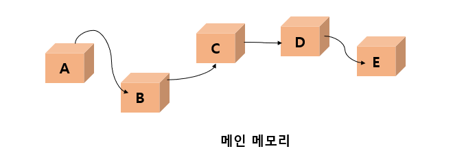

- 삽입연산 

  --> 연결리스트에서는 앞뒤에 있는 데이터들을 이동할 필요가 없이 줄만 변경	시켜주면 된다.

  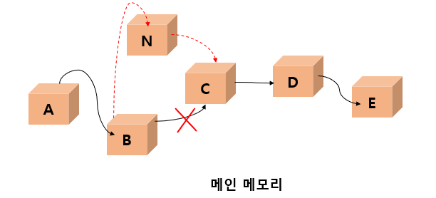

- 삭제연산

  --> 항목 C를 삭제하려고 하면 데이터들을 옮길 필요가 없이 그냥 데이터들을 	연결하는 줄만 수정하면 된다.

  <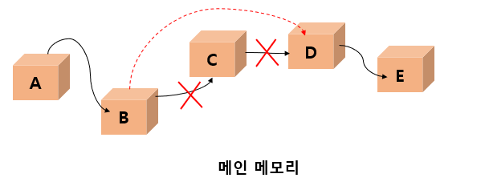

- 연결 리스트
  - 장점 : 데이터를 저장할 공간이 필요할 때마다 동적으로 공간을 만들어서 	쉽게 추가할 수 있다. 즉, 공간낭비가 없다.
  - 단점 : 배열에 비하여 상대적으로 구현이 어렵고 오류가 나기 쉽다. 

- 연결 리스트의 구조

  - 데이터 필드

    --> 우리가 저장하고 싶은 데이터

  - 링트 필드

    --> 다른 노드를 가리키는 포인터가 저장 , 마지막 노드의 링크필드는 NULL로 설정되는데 이는 더 이상 연결된 노드가 없다는 것을 의미

    

  


- malloc() 이용하여 동적 생성한 연결 리스트의 노드

  

- 연결 리스트의 종류

  - 단순 연결 리스트

    --> 하나의 방향으로만 연결되어 있는 리스트

    --> 마지막 노드의 링크는 NULL값을 가진다

  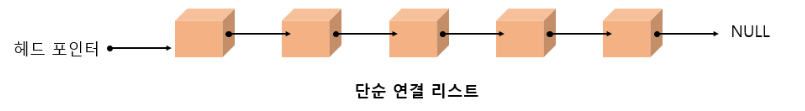

  - 원형 연결 리스트

    --> 마지막 노드의 링크가 첫번째 노드를 가리킨다.

  

  - 이중 연결 리스트

    --> 각 노드마다 2개의 링크가 존재

    --> 하나의 링크는 앞에 있는 노드를 가리키고 또 하나의 링크는 뒤에 있는 노드를 가르킴

  


## 6.4 단순 연결 리스트

- 노드의 정의
  - 자기 참조 구조체

    --> 자기 자신을 참조하는 포인터를 포함하는 구조체

  ```c
  typedef int element;
  
  typedef struct ListNode { // 노드 타입을 구조체로 정의
      element data;
      struct ListNode *link;
  } ListNode;
  ```

  

- 공백리스트의 생성

  --> 어떤 리스트가 공백인지를 검사하려면 헤드 포인터가 NULL인지를 검사

  ```c
  ListNode *head = NULL:
  ```

  

- 노드의 생성

  ```
  head = (ListNode *)malloc(sizeof(ListNode));
  ```

  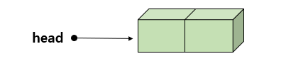

  ```c
  head -> data = 10;
  head -> link = NULL;
  ```

  

  

- 노드의 연결

  ```c
  ListNode *p;
  p = (ListNode *)malloc(sizeof(ListNode));
  p -> data = 20;
  p -> link = NULL;
  ```

  

  ```c
  head -> link = p;
  ```

  

  

## 6.5 단순연결 리스트의 연산 구현

- 단순 연결 리스트 정의

  ```c
  ListNode *head;
  ```

  - 삽입 연산 = insert_first()

    ```c
    ListNode* insert_first(ListNode *head, element value);
    ```

    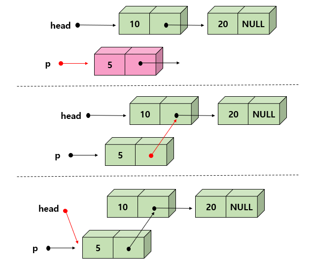

    - 알고리즘

      >insert_first(head, value) : // L : 연결리스트, value :추가할 값
      >
      >1.  p <- malloc()
      >2.  p -> data <- value
      >3.  p -> link <- head
      >4.  head <- p
      >5. return head

      ```c
      // 단순 연결 리스트의 삽입함수
      
      ListNode* insert_first(ListNode *head, int value)
      {
          ListNode *p = (ListNode *)malloc(sizeof(ListNode));
          p->data = value;
          p->link = head; // 헤드 포인터의 값을 복사
          head = p; // 헤드 포인터 변경
          return head; // 변경된 헤드 포인터 반환
      } 
      ```

      

  - 삽입 연산 = insert()

    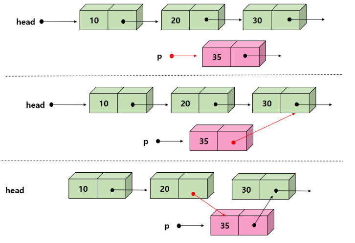

    - 알고리즘

      > insert(head, pre, value): // list : 연결, pre : 선형 노드, value : 추가할 값
      >
      > 1.  p <- malloc()
      > 2.  p -> data <- value
      > 3.  p -> link <- pre -> link
      > 4.  pre -> link <- p
      > 5.  return head

      ```c
      // 노드 pre 뒤에 새로운 노드 삽입
      
      ListNode* insert_first(ListNode *head, ListNode *pre, element value)
      {
          ListNode *p = (ListNode *)malloc(sizeof(ListNode));
          p->data = value;
          p->link = pre->link;
          pre->link = p;
          return head;
      } 
      ```

      

    - delete_first() 함수

      ```c
      ListNode* delete_first(ListNode *head)
      ```

      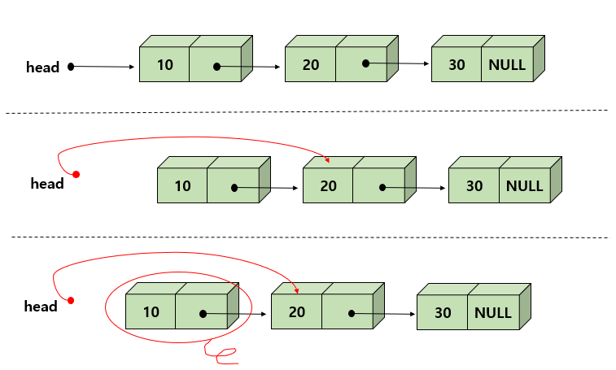

    - 알고리즘 

      > 1.  헤드 포인터의 값을 removed에 복사한다.
      > 2.  헤드 포인터의 값을 head -> link 로 변경한다.
      > 3.  removed 가 가리키는 동적 메모리를 반환한다.
      > 4.  변경된 헤드 포인터를 반환한다.

      ```c
      // 단순 연결 리스트의 삭제함수
      
      ListNode* delete_first(ListNode *head)
      {
          ListNode *removed;
          if (head==NULL) return NULL;
          removed = head;
          head = removed -> link;
          free(removed);
          return head;
      } 
      ```

    

    - 삭제 연산 delete()

      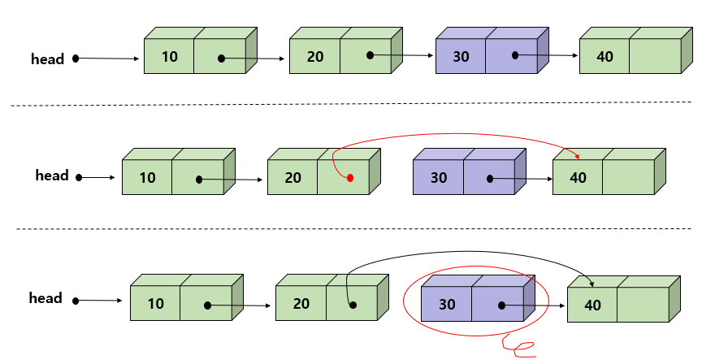

    - 알고리즘

      >delete(head, pre) :
      >
      >1.  removed <- pre -> link
      >2.  pre -> link <- removed -> link
      >3.  free (removed)
      >4.  return head

      ```c
      // pre가 가리키는 노드의 다음 노드를 삭제한다.
      
      ListNode* delete(ListNode *head, ListNode *pre)
      {
          ListNode *removed;
          removed = pre->link;
          pre->link = removed->link;
          free(removed);
          return head;
      } 
      ```

      

    - print_list()

      ```c
      void print_list(ListNode *head)
      {
          for(ListNode *p = head; p != NULL; p=p->link)
              printf("%d->", p->data);
          printf("NULL \n");
      }
      ```

      

 - 전체 코드

   ```c
   #include <stdio.h>
   #include <stdlib.h>
   
   typedef int element;
   typedef struct ListNode{
       element data;
       struct ListNode *link;
   }ListNode;
   
   void error(char *message)
   {
       fprintf(stderr, "%s\n", message);
       exit(1);
   }
   ListNode* insert_first(ListNode *head, int value)
   {
       ListNode* p = (ListNode *)malloc(sizeof(ListNode));
       p->data = value;
       p->link = head;
       head = p;
       return head;
   }
   ListNode* insert(ListNode *head, ListNode* pre, element value)
   {
       ListNode *p=(ListNode *)malloc(sizeof(ListNode));
       p->data = value;
       p->link = pre->link;
       pre->link = p;
       return head;
   }
   ListNode* delete_first(ListNode *head)
   {
       ListNode *removed;
       if (head == NULL) return NULL;
       removed = head;
       head = removed->link;
       free(removed);
       return head;
   }
   ListNode* delete(ListNode *head, ListNode *pre)
   {
       ListNode *removed;
       removed = pre -> link;
       pre->link = removed->link;
       free(removed);
       return head;
   }
   void print_list(ListNode *head)
   {
       for(ListNode *p = head; p!=NULL; p=p->link)
           printf("%d->", p->data);
           printf("NULL \n");
   }
   int main(void)
   {
       ListNode *head = NULL;
   
       for(int i =0; i<5; i++){
           head = insert_first(head, i);
           print_list(head);
       }
       for(int i = 0; i<5; i++)
       {
           head = delete_first(head);
           print_list(head);
       }
       return 0;
   }
   ```


## 6.6 연결리스트의 응용 : 다항식

- 다항식 노드의 구조

  

  ```c
  // 다항식 노드의 구조
  
  typedef struct ListNode{ // 노드 삽입
      int coef;
      int expon;
      struct ListNode *link;
  } ListNode;
  ```

  

- 연결리스트로 표현된 2개의 다항식

  예를 들어)  A(x) = 3x^12 + 2x^8 + 1

  ​				   B(x) = 8x^12 - 3x^10 + 10x^6

  

  

  ```c
  ListNode *A, *B;
  ```

  

- 연결리스트로 된 다항식 덧셈

  - 1.  p.expon == q.expon :

       -> 두 계수를 더해서 0이 아니면 새로운 항을 만들어 결과 다항식 C에 추가한다. 그리고 p와 q는 모두 다음 항으로 이동한다.

       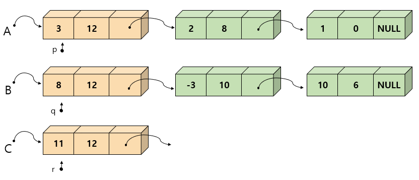

    2.  p.expon < q.expon :

       -> q가 지시하는 항을 새로운 항으로 복사하여 결과 다항식 C에 추가한다. 그리고 q만 다음항으로 이동한다.

       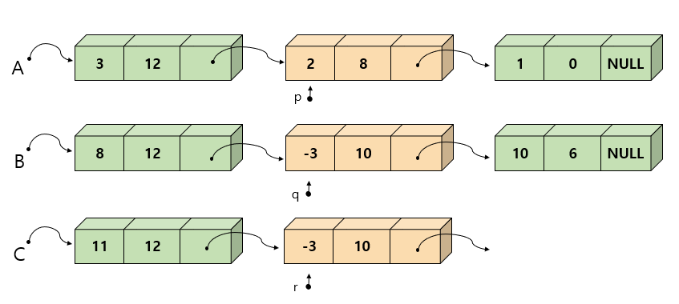

    3. p.expon > q.expon :

       -> p 가 지시하는 항을 새로운 항으로 복사하여 결과 다항식 C에 추가한다. 그리고 p만 다음 항으로 이동한다.

       


- 연결 리스트를 헤더 노드로 표현

  

  >  맨 끝에 노드를 추가하는 경우, 단순 연결 리스트의 경우, 매번 추가할 때마다 처음부터 포인터를 따라서 끝까지 가야 한다. 그러나 만일 마지막 노드를 항상 가리키는 포인터가 있는 경우에는 효율적으로 추가하는 것이 가능