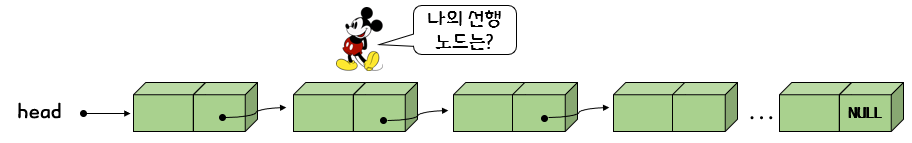
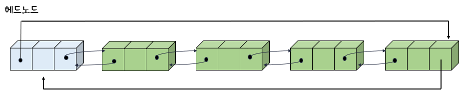
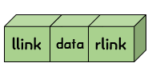
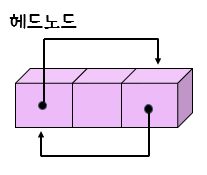
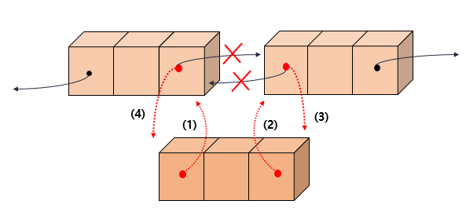
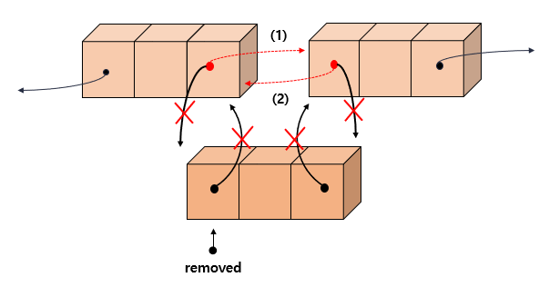
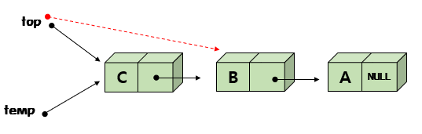
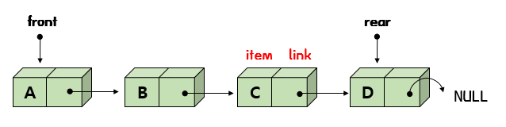
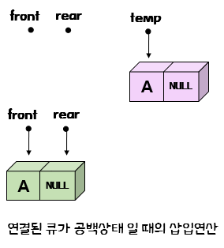
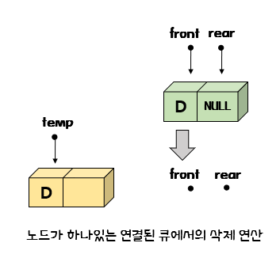

# 07 연결리스트 2

## 7.1 원형 연결 리스트

- 원형 연결 리스트 란?

  -> 마지막 노드가 첫 번째 노드를 가리키는 리스트

  -> 마지막 노드의 링크 필드가 널(NULL)이 아니라 첫번째 주소가 되는 리스트이다.

  - 장점

    -> 원형 리스트에서는 하나의 노드에서 다른 모든 노드로의 접근이 가능하다

    

  >원형 연결리스트가 유용한 경우는 리스트의 끝에 노드를 삽입하는 연산이 단순 연결 리스트 보다 효율적이다. 

  

  >마지막 노드는 헤드 포인터인 head가 가리키고 있고 첫번째 노드는 head->link 가 가리키고 있으므로, 리스트의 마지막에 노드를 삽입하거나 삭제하기 위하여 리스트의 맨 끝까지 힘들게 가지 않아도 된다.

  

- 원형 연결 리스트 정의

  ```c
  ListNode *head;
  ```

  -> 헤드 포인터만 있으면 된다.

  

- 원형 리스트의 처음에 삽입

  

  >새로운 노드의 링크인 node -> link  가 첫 번째 노드를 가리키게 하고 다음에  마지막 노드의 링크가 node 를 가리키게 하면 된다.

  ```c
  ListNode* insert_first(ListNode *head, element data)
  {
      ListNode *node=(ListNode *)malloc(sizeof(ListNode));
      node->data = data;
      if(head == NULL)
      {
          head = node;
          node -> link = head;
      }
      else
      {
          node->link = head->link;
          head->link = node;
      }
      return head;
  }
  ```

  

- 원형 리스트의 끝에 삽입

  

  >head의 위치만 새로운 노드로 바꾸어주면 새로운 노드가 마지막 노드가 된다. 

  ```c
  ListNode* insert_last(ListNode *head, element data)
  {
      ListNode *node=(ListNode *)malloc(sizeof(ListNode));
      node->data = data;
      if(head == NULL)
      {
          head = node;
          node -> link = head;
      }
      else
      {
          node->link = head->link;
          head->link = node;
          head = node;
      }
      return head;
  }
  ```

  

- 원형 연결 리스트 테스트 프로그램

  ```c
  #include <stdio.h>
  #include <stdlib.h>
  #define MAX_LIST_SIZE 100
  
  typedef int element;
  typedef struct ListNode{
      element data;
      struct ListNode *link;
  }ListNode;
  
  void print_list(ListNode *head)
  {
      ListNode* p;
  
      if(head == NULL) return;
      p=head->link;
      do{
          printf("%d->", p->data);
          p=p->link;
      }while (p != head);
      printf("%d->", p->data);
  }
  ListNode* insert_first(ListNode *head, element data)
  {
      ListNode *node = (ListNode *)malloc(sizeof(ListNode));
      node->data = data;
      if(head==NULL)
      {
          head=node;
          node->link=head;
      }
      else
      {
          node->link = head->link;
          head->link = node;
      }
      return head;
  }
  ListNode* insert_last(ListNode* head, element data)
  {
      ListNode *node = (ListNode *)malloc(sizeof(ListNode));
      node->data = data;
      if(head == NULL){
          head = node;
          node->link = head;
      }
      else
      {
          node->link = head -> link;
          head -> link = node;
          head = node;
      }
      return head;
  }
  int main(void)
  {
      ListNode *head = NULL;
  
      head = insert_last(head, 20);
      head = insert_last(head, 30);
      head = insert_last(head, 40);
      head = insert_first(head, 10);
      print_list(head);
      return 0;
  }
  ```

  

## 7.2 원형 연결 리스트는 어디에 사용될까?

- 어디에 사용될까?

  - 첫쨰, 컴퓨터에서 여러 응용 프로그램을 하나의 CPU를 이용하여 실행할 때에 필요

    

  >운영체제는 모든 응용 프로그램이 완료될 때까지 원형 연결 리스트를 계속 순회한다.

  

  - 두번째, 멀티 플레이어 게임이다. 모든 플레이어는 원형 연결 리스트에 저장되며 한 플레이어의 기회가 끝나면 포인터를 앞으로 움직여서 다음 플레이어의 순서가 된다.

    

  - 세번째, 원형 연결 리스트는 원형 큐를 만드는데도 사용할 수 있다. 

    

  > 원형 큐에서는 두 개의 포인터, front와 rear가 있어야 한다.

- 멀티 플레이어 게임

  ```c
  #include <stdio.h>
  #include <stdlib.h>
  #include <string.h>
  
  typedef char element[100];
  typedef struct ListNode {
      element data;
      struct ListNode *link;
  }ListNode;
  
  ListNode* insert_first(ListNode* head, element data)
  {
      ListNode *node = (ListNode *)malloc(sizeof(ListNode));
      strcpy(node -> data, data);
      if(head == NULL){
          head = node;
          node -> link = head;
      }
      else {
          node -> link = head -> link;
          head -> link = node;
      }
      return head;
  }
  
  int main(void)
  {
      ListNode *head = NULL;
  
      head = insert_first(head, "KIM");
      head = insert_first(head, "PARK");
      head = insert_first(head, "CHOI");
  
          ListNode* p = head;
      for(int i =0; i<0; i++){
          printf("현재 차례 = %s \n", p->data);
          p = p->link;
      }
      return 0;
  }
  ```

  

## 7.3 이중 연결 리스트

​	

	>단순 연결 리스트에서 어떤 노드에서 후속 노드를 찾기는 쉽지만, 선행 노드를 찾으려면 구조상 아주 어렵다. 이중연결 리스트는 양방향으로 자유롭게 움직이기 위한 것이다.


- 이중 연결 리스트

  -> 하나의 노드가 선행 노드와 후속 노드에 대한 두 개의 링크를 가지는 리스트이다.

  -> 링크가 양방향이므로 양방향으로 검색이 가능하다.

  - 단점

    -> 공간을 많이 차지하고 코드가 복잡해진다.

  

  > 헤드포인터는 리스트의 첫번쨰 노드를 가리키는 포인터

  

  > 노드는 3개의 필드 (왼쪽 링크 필드, 데이터 필드, 오른쪽 링크 필드)


```c
p = p->llink->rlink = p->rlink->llink
```



```c
typedef int element;
typedef struct DListNode{ // 이중 연결 노드 타입
	element data;
	struct DListNode* llink;
	struct DListNode* rlink;
} DListNode;
```


- 삽입연산

  

  ```c
  // 새로운 데이터를 노드 before의 오른쪽에 삽입한다.
  
  void dinsert(DListNode *before, element data)
  {
      DListNode *newnode = (DListNode *)malloc(sizeof(DListNode));
      strcpy(newnode -> data, data);
      newnode -> llink = before;
      newnode -> rlink = before -> rlink;
      before -> rlink -> llink = newnode;
      before -> rlink = newnode;
  }
  ```

  

- 삭제 연산

  

  ```c
  // 노드 removed를 삭제한다.
  
  void ddelete(DListNode * head, DListNode* removed)
  {
      if (removed == head) return;
      removed -> llink -> rlink = removed -> rlink;
      removed -> rlink -> llink = removed -> llink;
      free(removed);
  }
  ```

  

- 완전한 프로그램

  ```c
  #include <stdio.h>
  #include <stdlib.h>
  #include <string.h>
  
  typedef int element;
  typedef struct DListNode{
      element data;
      struct DListNode *llink;
      struct DListNode *rlink;
  }DListNode;
  
  void init(DListNode* phead)
  {
      phead -> llink = phead;
      phead -> rlink = phead;
  }
  
  void print_dlist(DListNode* phead)
  {
      DListNode* p;
      for (p=phead -> rlink; p != phead; p = p->rlink)
      {
          printf("<-| |%d| |->", p->data);
      }
      printf("\n");
  }
  
  void dinsert(DListNode *before, element data)
  {
      DListNode *newnode = (DListNode *)malloc(sizeof(DListNode));
      newnode->data=data;
      newnode -> llink = before;
      newnode -> rlink = before -> rlink;
      before -> rlink -> llink = newnode;
      before -> rlink = newnode;
  }
  
  void ddelete(DListNode * head, DListNode* removed)
  {
      if (removed == head) return;
      removed -> llink -> rlink = removed -> rlink;
      removed -> rlink -> llink = removed -> llink;
      free(removed);
  }
  
  int main(void)
  {
      DListNode* head = (DListNode *)malloc(sizeof(DListNode));
      init(head);
      printf("추가단계 \n");
      for(int i =0; i<5; i++){
          dinsert(head, i);
          print_dlist(head);
      }
      printf("\n삭제 단계\n");
      for(int i=0; i<5; i++){
          print_dlist(head);
          ddelete(head, head->rlink);
      }
      free(head);
      return 0;
  }
  ```

  

- 연결 리스트로 구현한 스택

  

  >스택이나 큐를 연결된 스택 이라고 한다.

  - 연결된 스택

    -> 노드는 우리가 저장하고 싶은 데이터 필드와 다음 노드를 가리키기 위한 포인터가 들어 있는 링크 필드로 구성된다. 또한, top은 더 이상 정수가 아니고, 노드를 가리키는 포인터로 선언된다. 연결된 스택에 관련된 데이터는 top포인터뿐이지만 일관성을 위하여 LinkedStackType이라는 구조체 타입으로 정의되었다. 

    ```c
    typedef int element;
    typedef struct StackNode{
        element data;
        struct StackNode *link;
    }StackNode;
    
    typedef struct{
        StackNode *top;
    } LinkedStackType;
    ```

    

    - 삽입

      

      >연결된 스택은 개념적으로 단순 연결 리스트에서 맨 앞에 데이터를 삽입하는 것과 동일하다. 
      >
      >연결된 스택에서는 헤드 포인터가 top이라는 이름으로 불리는 것 이외에는 별 차이점이 없다. 삽입연산에서는 먼저 동적 메모리 할당으로 노드를 만들고 이 노드를 첫 번째 노드로 삽입한다. 
      >
      >top의 값을 temp -> link에 복사한 다음, temp를 top에 복사하면 된다.

    - 삭제

      
      
      > top의 값을 top -> link로 바꾸고 기존의 top이 가리키는 노드를 동적메모리 해체하면 된다.
      >
      > 연결된 스택에서 공백상태는 연결 리스트와 마찬가지로 top포인터가 NULL인 경우이다. 포화상태는 동적 메모리 할당만 된다면 노드를 생성할 수 있기 때문에 없는거나 마찬가지이다. 
      
      ```c
      #include <stdio.h>
      #include <malloc.h>
      #include <stdlib.h>
      #include <string.h>
      
      typedef int element;
      typedef struct StackNode {
          element data;
          struct StackNode *link;
      }StackNode;
      
      typedef struct {
          StackNode *top;
      } LinkedStackType;
      
      void init(LinkedStackType *s) 
      {
          s->top = NULL;
      }
      
      int is_empty(LinkedStackType *s) 
      {
          return (s->top == NULL);
      }
      
      int is_full(LinkedStackType *s) 
      {
          return 0;
      }
      
      void push(LinkedStackType *s, element item) // 삽입함수
      {
          StackNode *temp = (StackNode *)malloc(sizeof(StackNode));
          temp -> data = item;
          temp -> link = s -> top;
          s->top = temp;
      }
      
      void print_stack(LinkedStackType *s)
      {
          for(StackNode *p = s->top; p!= NULL; p = p->link)
              printf("%d->", p->data);
          printf("NULL \n");
      }
      
      element pop(LinkedStackType *s) // 삭제함수
      {
          if (is_empty(s)){
              fprintf(stderr, "스택이 비어있음\n");
              exit(1);
          }
          else {
              StackNode *temp = s->top;
              int data = temp -> data;
              s->top = s->top->link;
              free(temp);
              return data;
          }
      }
      
      element peek(LinkedStackType *s)
      {
          if(is_empty(s))
          {
              fprintf(stderr,"스택이 비어있음\n");
              exit(1);
          }
          else
          {
              return s->top->data;
          }
      }
      
      int main(void)
      {
          LinkedStackType s;
          init(&s);
          push(&s, 1); print_stack(&s);
          push(&s, 2); print_stack(&s);
          push(&s, 3); print_stack(&s);
          pop(&s); print_stack(&s);
          pop(&s); print_stack(&s);
          pop(&s); print_stack(&s);
          return 0;
      }
      
      ```
      
      

## 7.5 연결리스트로 구현한 큐

- 연결 리스트로 구현한 큐

  

  >front 포인터는 삭제와 관련되며 rear 포인터는 삽입과 관련된다. front 는 연결리스트의 맨 앞에 있는 요소를 가리키며, rear 포인터는 맨 뒤에 있는 요소를 가리킨다. 큐에 요소가 없는 경우에는 front와 rear는 NULL값이 된다. 

- 연결된 큐 정의

  ```c
  typedef int element;
  typedef struct QueueNode {
  	element data;
  	struct QueueNode *link;
  } QueueNode;
  
  typedef struct {
  	QueueNode *front, *rear;
  } LinkedQueueType;
  ```

  

- 삽입 연산

  

  >front와 rear가 모두 NULL이면 front 와 rear 모두 새로운 노드를 가리키도록 해야 한다. 

  

  

  >공백상태가 아니고 기존의 노드가 있는 경우라면 rear가 가리키고 있는 노드의 링크필드와 rear를 새로운 노드를 가리키도록 변경

  ```c
  // 삽입 함수
  
  void enqueue(LinkedQueueType *q, element data)
  {
      QueueNode *temp = (QueueNode *)malloc(sizeof(QueueNode));
      temp -> data = data;
      temp -> link = NULL;
      if(is_empty(q))
      {
          q->front = temp;
          q->rear = temp;
      }
      else{
          q->rear -> link = temp;
          q->rear = temp;
      }
  }
  ```

  

- 삭제 연산

  

  

  

  > front 가 가리키는 노드를 temp가 가리키도록 하고 front 는 front 의 링크값으로 대입한다. 
  >
  > 그러면 front 는 현재 가리키는 노드의 다음 노드를 가리키게 될 것이다. 그런 다음, temp가 가리키는 노드로부터 데이터를 꺼내오고 동적 메모리 해제를 통하여 이 노드를 삭제하면 된다.

  ```c
  // 삭제 함수
  
  element dequeue(LinkQueueType *q)
  {
      QueueNode *temp = q->front;
      element data;
      if(is_empty(q))
      {
          fprintf(stderr, "스택이 비어있음\n");
          exit(1);
      }
      else
      {
          data = temp -> data;
          q->front = q->front->link;
          if(q<-front == NULL)
              q->rear = NULL;
          free(temp);
          return data;
      }
  }
  ```

  

- 연결된 큐 프로그램

  ```c
  #include <stdio.h>
  #include <stdlib.h>
  
  typedef int element;
  typedef struct QueueNode{
      element data;
      struct QueueNode *link;
  }QueueNode;
  
  typedef struct{
      QueueNode *front, *rear;
  } LinkedQueueType;
  
  void init(LinkedQueueType *q) 
  {
      q->front = q->rear =0;
  }
  
  int is_empty(LinkedQueueType *q) 
  {
      return (q->front == NULL);
  }
  
  int is_full(LinkedQueueType *s) 
  {
      return 0;
  }
  
  void enqueue(LinkedQueueType *q, element data)
  {
      QueueNode *temp = (QueueNode *)malloc(sizeof(QueueNode));
      temp -> data = data;
      temp -> link = NULL;
      if(is_empty(q))
      {
          q->front = temp;
          q->rear = temp;
      }
      else{
          q->rear -> link = temp;
          q->rear = temp;
      }
  }
  
  element dequeue(LinkedQueueType *q)
  {
      QueueNode *temp = q->front;
      element data;
      if(is_empty(q))
      {
          fprintf(stderr, "스택이 비어있음\n");
          exit(1);
      }
      else
      {
          data = temp -> data;
          q->front = q->front->link;
          if(q->front == NULL)
              q->rear = NULL;
          free(temp);
          return data;
      }
  }
  void print_queue(LinkedQueueType *q)
  {
      QueueNode *p;
      for(p=q->front; p != NULL; p = p->link)
          printf("%d->",p->data);
      printf("NULL\n");
  }
  
  int main(void)
  {
      LinkedQueueType queue;
  
      init(&queue);
  
      enqueue(&queue, 1); print_queue(&queue);
      enqueue(&queue, 2); print_queue(&queue);
      enqueue(&queue, 3); print_queue(&queue);
      dequeue(&queue); print_queue(&queue);
      dequeue(&queue); print_queue(&queue);
      dequeue(&queue); print_queue(&queue);
      return 0;
  }
  ```

  

  